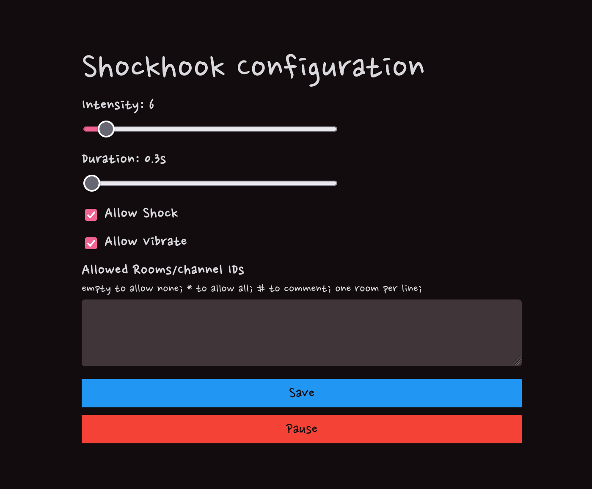

# shockhook

Webhook API connecting to [Openshock](https://openshock.org).

## Environment

```sh
OPENSHOCK_API_TOKEN=...
OPENSHOCK_SHOCKER_ID=8eca162a-cf0d-4403-80b0-1dd4f6362c7c
OPENSHOCK_API_SERVER=https://api.shocklink.net
SHOCKHOOK_ADDR=localhost:8080
SHOCKHOOK_SECRET=secret
```

## API

#### Sending a command

```ts
fetch(`/command/${secret}`, {
  method: 'POST',
  body: JSON.stringify({
    author_user: '...',
    target_user: '...',
    room_id: '...',
    command: '...', // "shock" | "zap" | "vibrate"
  }),
})
```

#### Admin configuration

Head to **/admin**. The endpoint is not protected; you must use a front proxy
to add your own authentication. Internally, I am using Tailscale for this.


